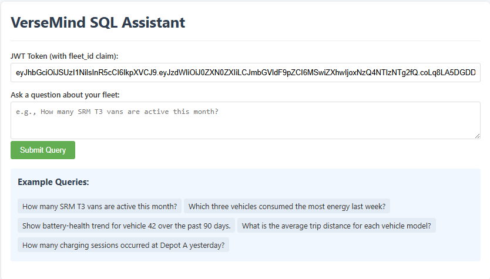

# VerseMind SQL Assistant

[](https://github.com/topgoer/VerseMind_SQL_Assistant/actions/workflows/ci.yml)

A natural language analytics layer for fleet operators with dual interface support for standard chat and Model Control Protocol (MCP).



## Features

- **Natural Language to SQL**: Convert plain English questions to SQL queries
- **Dual Interface**: Standard chat endpoint and MCP (Model Control Protocol) support
- **Security**: Row-Level Security (RLS) for multi-tenant data isolation
- **Frontend**: React SPA with adjustable panels for chat and MCP interaction
- **Deployment**: Docker setup for one-command startup

## Quick Start

### Prerequisites

- Docker and Docker Compose v2+ (the project uses modern Compose features)
- OpenAI API key (or Anthropic/Mistral/DeepSeek as fallbacks)
- Python 3.12+ (for local development)

### Installation

1. Clone the repository:

```bash
git clone https://github.com/topgoer/VerseMind_SQL_Assistant.git
cd VerseMind_SQL_Assistant
```

2. Create a `.env` file from the example:

```bash
cp .env.example .env
```

3. Edit the `.env` file to add your database connection and at least one LLM API key:

```
DATABASE_URL=postgresql+asyncpg://postgres:postgres@db:5432/sql_assistant
OPENAI_API_KEY=your_openai_api_key
# Optional fallbacks
# ANTHROPIC_API_KEY=your_anthropic_api_key
# MISTRAL_API_KEY=your_mistral_api_key
# DEEPSEEK_API_KEY=your_deepseek_api_key
ENABLE_MCP=1  # Set to 1 to enable Model Control Protocol support
```

   Note: The JWT_PUBLIC_KEY environment variable is not needed as the public.pem file is directly mounted in the container.

4. Start the application:

```bash
docker compose up -d
```

5. Generate authentication keys and JWT token:

For Windows:
```powershell
# Generate for fleet_id=1 (default)
.\gen_jwt.ps1

# Or specify a different fleet_id
.\gen_jwt.ps1 2
```

For Linux/MacOS:
```bash
# Make the script executable (first time only)
chmod +x gen_jwt.sh

# Generate for fleet_id=1 (default)
./gen_jwt.sh

# Or specify a different fleet_id
./gen_jwt.sh 2
```

   This script creates public.pem and private.pem files in the project root, which are used for JWT authentication. 
   The public.pem file is automatically mounted into the Docker container - no need to set JWT_PUBLIC_KEY environment variable.

6. Import sample data (one-time setup):

```bash
docker compose --profile seed up

# This command imports all CSV files from the 'upload' directory into the database,
# creates necessary tables, and sets up Row-Level Security (RLS) policies
```

   Note: The seed service uses the same environment variables from your `.env` file.

7. Access the application:
   - Frontend (development): http://localhost:5173 (run `npm run dev` in the frontend directory)
   - API: http://localhost:8001
   - Chat Interface: http://localhost:8001/chat.html

### Verifying Data Import

To check if the data import was successful:

```bash
# Check import logs
docker compose logs seed
```

You should see messages like "Imported X rows into [table_name]" for each CSV file and "Database setup completed successfully!" at the end.

**Troubleshooting Import Issues**:
- Ensure all required CSV files are in the `upload` directory
- If Docker has connection issues, try `docker compose down` first, then restart
- Wait for the database service to be fully initialized before running the seed command
- The seed service automatically truncates tables before importing, so it's safe to run multiple times

**Updating API Keys**:
If you need to update your API key or other environment variables:
1. Edit the `.env` file with your new values
2. Run the included script to recreate containers with fresh environment variables:

For Windows:
```powershell
.\rebuild_and_test.ps1
```

For Linux/MacOS:
```bash
# Make the script executable (first time only)
chmod +x rebuild_and_test.sh

# Run the script
./rebuild_and_test.sh
```

This script completely recreates containers to ensure they use the latest environment variables and runs the test suite.

## Development

### Backend Setup

1. Create a virtual environment:

For Windows:
```powershell
python -m venv venv
.\venv\Scripts\activate
```

For Linux/MacOS:
```bash
python -m venv venv
source venv/bin/activate
```

2. Install dependencies:
```bash
pip install uv
uv pip install -r requirements.txt
```

3. Run the development server:

```bash
uvicorn sql_assistant.main:app --reload
```

### Frontend Setup (React + TypeScript)

The frontend is a modern React Single Page Application (SPA) built with TypeScript, Vite, and Tailwind CSS.

1. Navigate to the frontend directory:

```bash
cd frontend
```

2. Install dependencies:

```bash
npm install
```

3. Start the development server:

```bash
npm run dev
```

- The app will be available at http://localhost:5173/ (development server)
- The frontend will automatically proxy API requests to the backend (see `vite.config.ts` for proxy settings)
- Note: For production deployment, the frontend would need to be built with `npm run build` and served separately

#### Troubleshooting
- If you see styling issues, ensure you are using Tailwind CSS v3 (see `package.json`).
- If you get 404 errors for API calls, make sure your backend is running and the proxy is configured in `vite.config.ts`.
- If you see dependency errors during `npm install`, use `npm install --legacy-peer-deps` or update your Node/npm version.
- For TypeScript or module errors in your editor, ensure you have run `npm install` and restart your editor.

#### Building for Production

To build the frontend for production:

```bash
npm run build
```

The output will be in the `dist/` directory.

## Testing

### Running Tests

For Windows:
```powershell
# Run all tests
pytest

# Run with coverage
pytest --cov=sql_assistant --cov-report=xml
```

For Linux/MacOS:
```bash
# Run all tests
PYTHONPATH=. pytest

# Run with coverage
PYTHONPATH=. pytest --cov=sql_assistant --cov-report=xml
```

## API Documentation

### Chat Endpoint

```
POST /chat
```

### MCP Endpoint

```
POST /mcp
```

## Project Structure

```
sql_assistant/
├── .github/                    # GitHub configuration files
│   └── workflows/             # CI/CD workflows
├── .ruff_cache/               # Ruff linter cache
├── .pytest_cache/             # Pytest cache
├── db/                        # Database related files
│   ├── import_data.py        # Data import and RLS setup (IMPORTANT)
│   └── RLS_SETUP.sql         # Row-Level Security configuration
├── docs/                      # Documentation files
├── examples/                  # Example code and usage
│   └── call_mcp.py           # MCP client example
├── frontend/                  # React SPA frontend
│   ├── public/               # Static assets
│   ├── src/                  # Source code
│   │   ├── components/       # React components
│   │   ├── services/         # API services
│   │   └── styles/           # CSS styles
│   ├── package.json         # NPM dependencies
│   └── vite.config.ts       # Vite configuration
├── scripts/                   # Utility scripts
│   ├── gen_keys_and_jwt.py  # JWT key generation
│   └── make_dummy_jwt.py    # JWT token generation
├── sql_assistant/            # Main application code
│   ├── services/             # Business logic services
│   │   └── domain_glossary.py # Domain-specific terms
│   ├── schemas/              # Data models and schemas
│   ├── main.py              # FastAPI application entry point
│   ├── guardrails.py        # Query validation and safety checks
│   ├── auth.py              # Authentication and authorization
│   └── __init__.py          # Package initialization
├── static/                    # Static assets
│   ├── chat.html             # Web-based chat interface
│   └── screenshot.png        # Project screenshot
├── tests/                     # Test suite
│   ├── integration/          # Integration tests
│   └── unit/                 # Unit tests
├── upload/                    # Data import directory
├── .env.example              # Example environment variables
├── .gitignore                # Git ignore rules
├── CHANGELOG.md              # Version history
├── Dockerfile                # Docker build instructions
├── LICENSE                   # MIT License
├── README.md                 # Project documentation
├── TESTING_SUMMARY.md        # Test coverage and results
├── docker-compose.test.yml   # Test environment configuration
├── docker-compose.yml        # Docker services configuration
├── gen_jwt.ps1              # Windows JWT generation script
├── gen_jwt.sh               # Linux/MacOS JWT generation script
├── package-lock.json         # NPM lock file
├── package.json              # NPM package configuration
├── pytest.ini               # Pytest configuration
├── rebuild_and_test.ps1     # Windows rebuild and test script
├── rebuild_and_test.sh      # Linux/MacOS rebuild and test script
├── requirements.txt          # Python dependencies
└── setup.py                 # Python package configuration
```

## Important Files

### Configuration Files
- `.env.example` - Template for environment variables
- `docker-compose.yml` - Docker services configuration
- `Dockerfile` - Container build instructions
- `requirements.txt` - Python dependencies
- `frontend/package.json` - Frontend dependencies

### Database and Data Files
- `db/import_data.py` - Core data import functionality and RLS setup
  - Handles CSV data import with automatic schema detection
  - Sets up Row-Level Security (RLS) policies
  - Supports multi-tenant data isolation
- `db/RLS_SETUP.sql` - Row-Level Security configuration
- `upload/` - Directory for your CSV data files
  - Place your CSV files here for import
  - Files should follow the expected schema for each table

### Platform-Specific Scripts
For Windows:
- `rebuild_and_test.ps1` - Rebuild containers and run tests
- `gen_jwt.ps1` - Generate JWT tokens and keys

For Linux/MacOS:
- `rebuild_and_test.sh` - Rebuild containers and run tests
- `gen_jwt.sh` - Generate JWT tokens and keys

### Authentication Files
- `public.pem` - Public key for JWT verification (generated by scripts)
- `private.pem` - Private key for JWT signing (generated by scripts)

### Core Application Files
- `sql_assistant/main.py` - FastAPI application entry point
- `sql_assistant/auth.py` - Authentication and authorization
- `sql_assistant/guardrails.py` - Query validation and safety checks
- `frontend/src/App.tsx` - Main React application component

### Test Files
- `tests/unit/` - Unit tests
- `tests/integration/` - Integration tests
- `pytest.ini` - Test configuration
- `docker-compose.test.yml` - Test environment configuration

### Documentation
- `README.md` - Project documentation
- `CHANGELOG.md` - Version history
- `TESTING_SUMMARY.md` - Test coverage and results

## License

This project is licensed under the MIT License - see the LICENSE file for details.